# Audubon Bird Plates

A collection of all 435 illustrations of John James Audubon's [Birds of America](https://www.audubon.org/birds-of-america) for the purposes of education, research, and free and fair use.

These beautiful illustrations have been adapted to be used as screensavers on the [Ratta Supernote](https://supernote.com) and other similar e-ink tablets. The full resolution images have been downsized so that at least one dimension is 2000px. For reference, the Ratta Supernote A5X, A6X, and reMarkable 2 all have screen resolutions of 1404x1872px. A repository of the original full resolution images can be found [here](https://github.com/nathanbuchar/audubon-bird-plates).

Courtesy of the John James Audubon Center at Mill Grove, Montgomery County Audubon Collection, and Zebra Publishing. Compiled by [Nathan Buchar](https://nathanbuchar.com). Total download size approx 468MB.

 

  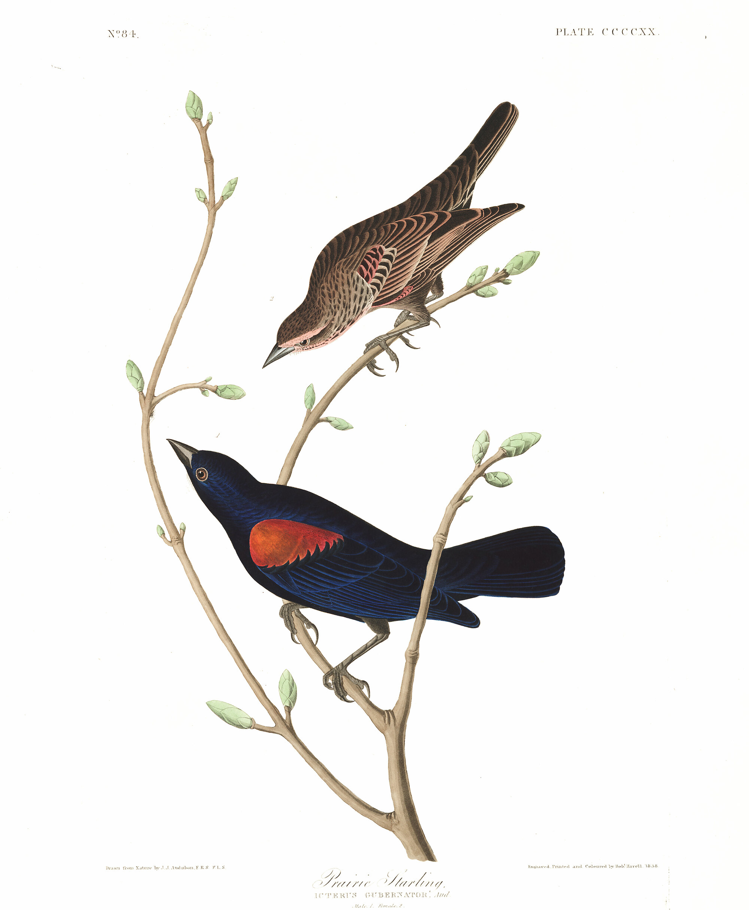

 

Please consult Audubon's [Terms of Use](https://www.audubon.org/terms-use) before downloading, and please credit the illustrations as follows: "Courtesy of the John James Audubon Center at Mill Grove, Montgomery County Audubon Collection, and Zebra Publishing."

---

## Library

**Plates 1-99**

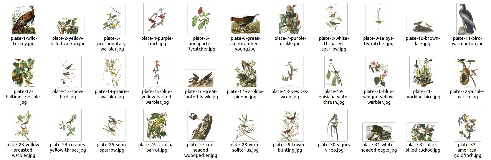
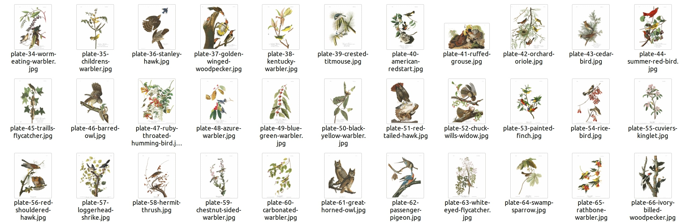
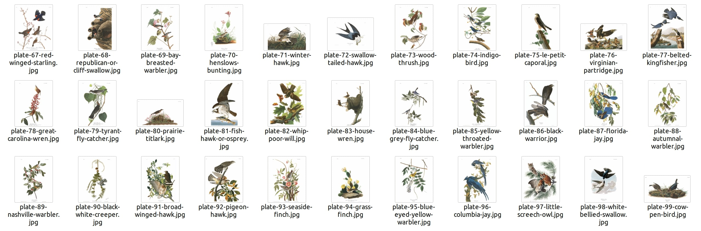

**Plates 100-199**

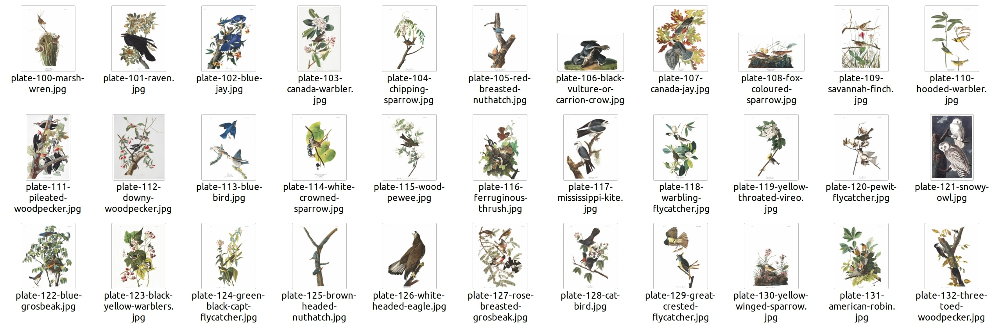
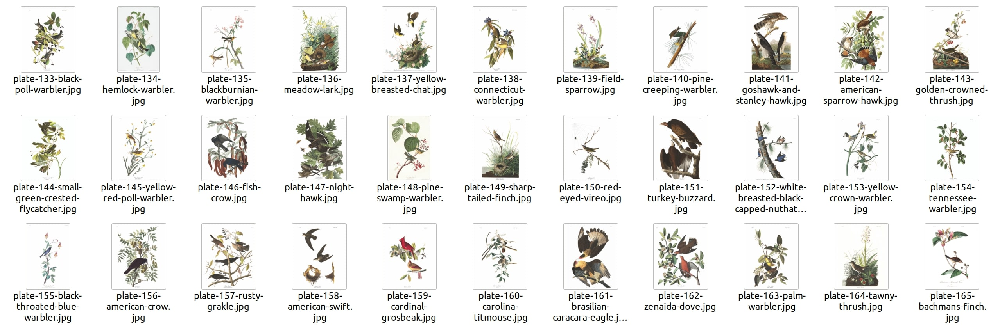
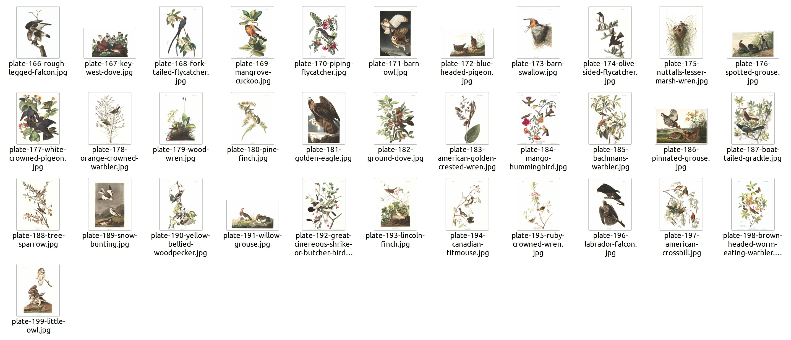

**Plates 200-299**

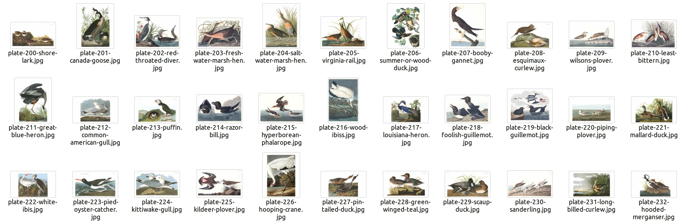
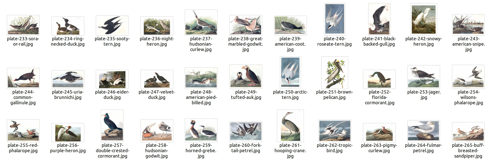
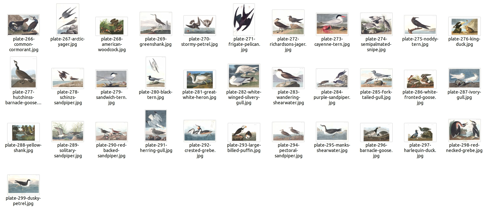

**Plates 300-399**

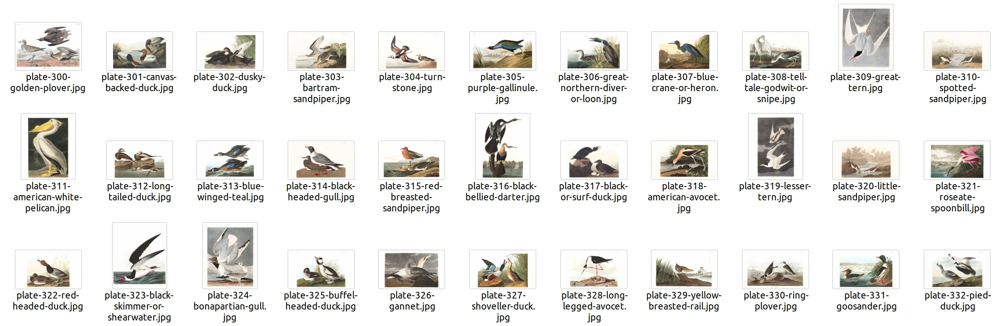
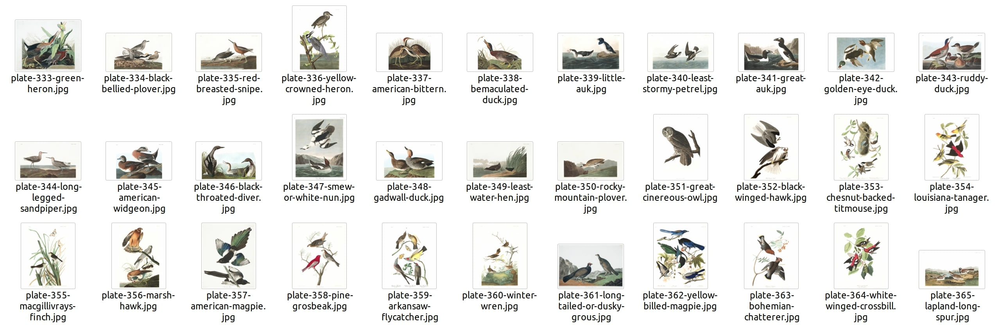
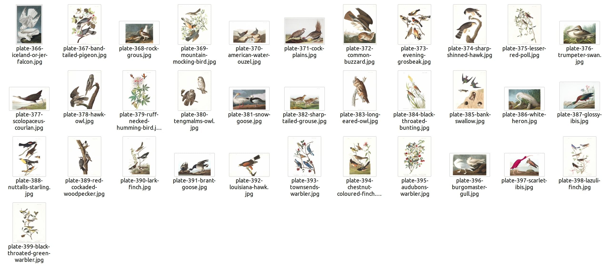

**Plates 400-435**

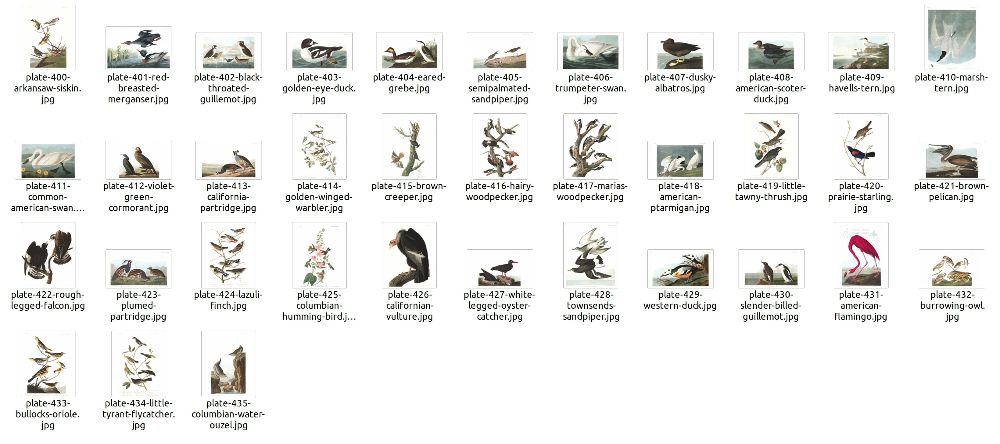
